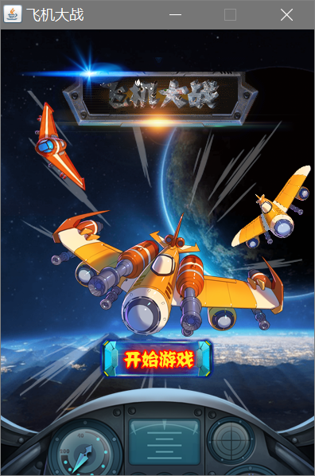
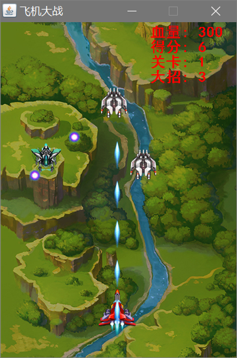
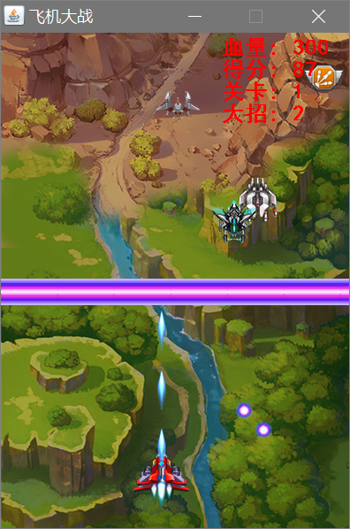
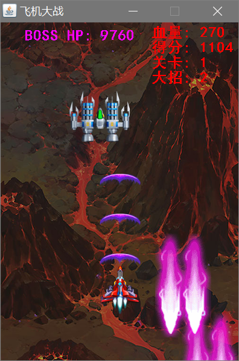
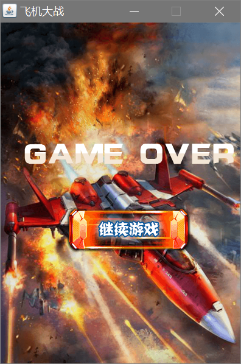

# PlaneWar 飞机大战游戏

## 简介

一款经典的飞机大战游戏，基于`Java Swing`实现。

总共含有四个关卡，每关均有boss，难度依次递增。击毁敌机有一定机率出现奖励，奖励主要有三种：加血，增加大招次数和升级飞机炮弹。

## 操作

鼠标控制飞机移动，鼠标左键放大招。

## 截图

### 开始界面

### 游戏界面

### 释放大招

### boss敌机

### 结束界面

## 更新日志

### V 1.0 (2018-10-22)

+ 重构部分重复代码
+ 将部分代码封装成函数，提高可读性
+ 添加注释